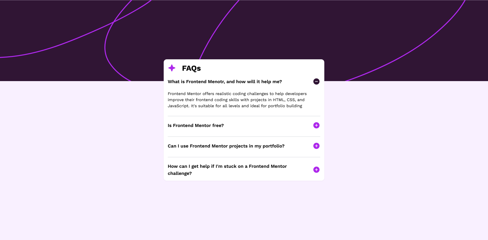

# Frontend Mentor - FAQ accordion solution

This is a solution to the [FAQ accordion challenge on Frontend Mentor](https://www.frontendmentor.io/challenges/faq-accordion-wyfFdeBwBz). Frontend Mentor challenges help you improve your coding skills by building realistic projects. 

## Table of contents

- [Overview](#overview)
  - [The challenge](#the-challenge)
  - [Screenshot](#screenshot)
  - [Links](#links)
- [My process](#my-process)
  - [Built with](#built-with)
  - [Useful resources](#useful-resources)
- [Author](#author)

## Overview

### The challenge

Users should be able to:

- Hide/Show the answer to a question when the question is clicked
- Navigate the questions and hide/show answers using keyboard navigation alone
- View the optimal layout for the interface depending on their device's screen size
- See hover and focus states for all interactive elements on the page

### Screenshot

### Links

- Solution URL: [Github Repo](https://github.com/awesooomeME/faq_accordion)
- Live Site URL: [Live Site](https://faq-accordion-neon.vercel.app/)
- Frontendmentor Solution URL: [Add live site URL here](https://www.frontendmentor.io/solutions/faq-accordion-with-nextjs-lRQeedWq_e)

## My process

### Built with

- Semantic HTML5 markup
- CSS custom properties
- Flexbox
- CSS Grid
- Mobile-first workflow
- [React](https://reactjs.org/) - JS library
- [Next.js](https://nextjs.org/) - React framework
- [Tailwind](https://tailwindcss.com/)

### Useful resources

- [CSS Reset](https://www.joshwcomeau.com/css/custom-css-reset/) - This article explains the CSS reset that I used in this project.

## Author

- Frontend Mentor - [@awesooomeME](https://www.frontendmentor.io/profile/awesooomeME)
- Github - [@awesooomeME](https://github.com/awesooomeME)